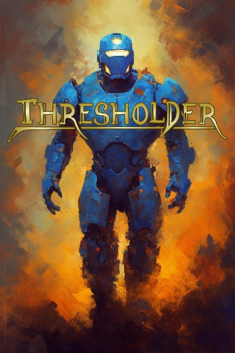
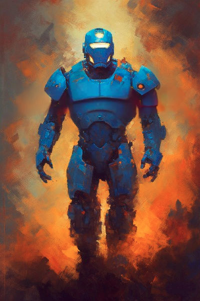
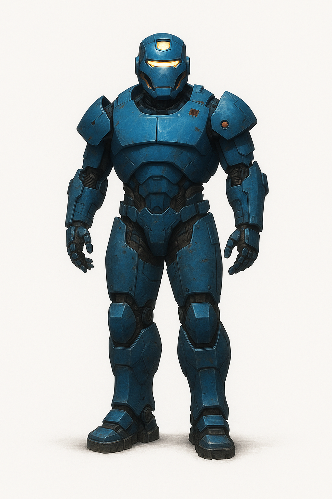
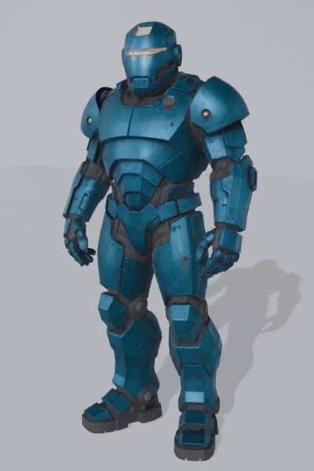

# 20250619-thresholder-powerarmor-aigen
Demo of current day image transformation and model generation procedures on the cover character of the Thresholder series by Alexander Wales.

## Steps

### Source Image
From the [Thresholder RR Page.](https://www.royalroad.com/fiction/60396/thresholder)

### Image Cleanup
Using [Dingboard](https://dingboard.com/) to regenerate the armor parts lost to the title.

### ChatGPT Image Generation
Prompt:
> I made this image with gen ai a few years back, and i really liked the shapes on the helmet, pauldrons and leg protectors, but now i want a version of this armor without the fire and smoke and without the abstract square shading - can you remove the fire and smoke, and give a little more definition to the legs and fingers?

### 3D Model Generation
Using the Hunyuan3D-v2.5 model hosted on [this website](https://3d.hunyuan.tencent.com/) following [this youtube tutorial](https://www.youtube.com/watch?v=WthSqEV2Nt4), output is the "03-Hunyuan3D-V2.5 model.glb" file.

The model can be viewed in model inspectors like [this one.](https://gltf.report/)
